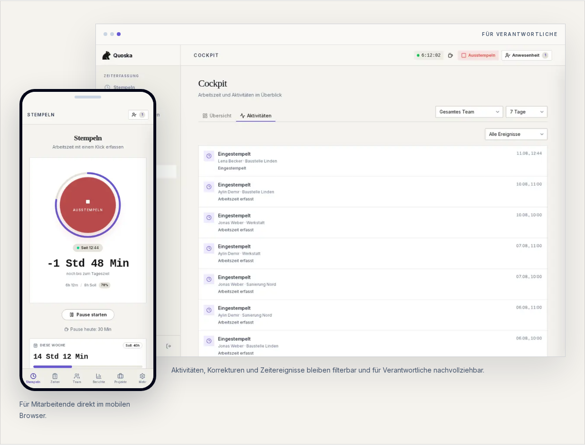

<p align="center">
  <picture>
    <source media="(prefers-color-scheme: dark)" srcset="public/banner-dark.png">
    <source media="(prefers-color-scheme: light)" srcset="public/banner-light.png">
    
  </picture>
</p>

<h3 align="center">Digitale Zeiterfassung für kleine Betriebe. Ohne Theater.</h3>

<p align="center">
  Arbeitszeit, Pausen, Abwesenheiten und nachvollziehbare Korrekturen in einer ruhigen,<br>
  vollständig offenen Web-Anwendung für deutsche Teams.
</p>

<p align="center">
  <a href="https://quoska.de"></a>
  <a href="https://github.com/quoska-hq/quoska/actions/workflows/ci.yml"></a>
  <a href="LICENSE"></a>
  
</p>

<p align="center">
  <a href="https://quoska.de"><strong>Hosted ausprobieren</strong></a> ·
  <a href="#schnellstart">Lokal starten</a> ·
  <a href="docs">Dokumentation</a> ·
  <a href="CONTRIBUTING.md">Mitmachen</a>
</p>

<br>

<p align="center">
  <a href="https://quoska.de">
    
  </a>
</p>

## Warum Quoska?

Viele Zeiterfassungen sind entweder eine einfache Stoppuhr oder ein großes
Verwaltungssystem. Quoska konzentriert sich auf den vollständigen Arbeitsalltag
kleiner Teams: schnell stempeln, Abweichungen früh erkennen und Änderungen
nachvollziehbar bearbeiten.

| Für Mitarbeitende | Für Verantwortliche |
| --- | --- |
| Beginn, Pause und Feierabend mit einem Klick | Cockpit mit Arbeitszeit, Aufgaben und Projekten |
| Eigene Zeiten und Abwesenheiten einsehen | Korrekturanträge prüfen und Verlauf nachvollziehen |
| Urlaub und Krankheit im selben System | Rollen, Arbeitsmodelle und Team verwalten |
| Im mobilen Browser nutzbar | Zeitraumbezogene Berichte und CSV-Export |

## Was enthalten ist

- **Stempeluhr und Pausen** mit serverseitigen Zeitstempeln
- **Korrekturen mit Begründung** und unveränderlichem Audit-Verlauf
- **Admin-Cockpit** mit offenen Aufgaben, Teamstatus und Arbeitszeitentwicklung
- **Urlaub und Krankheit** inklusive Anträgen und Freigaben
- **Flexible Wochenpläne** für Teilzeit und unterschiedliche Arbeitstage
- **Feiertage nach Bundesland**, Projekte, Rollen und CSV-Berichte
- **Mandantentrennung per PostgreSQL RLS** und Soft-Deletes für Zeitdaten
- **PWA** für Desktop und mobilen Browser

> Quoska unterstützt Betriebe bei der Dokumentation und Prüfung von
> Arbeitszeiten. Die konkrete betriebliche und rechtliche Umsetzung bleibt in
> der Verantwortung des Arbeitgebers.

## Hosted oder selbst hosten

| | Hosted auf [quoska.de](https://quoska.de) | Selbst gehostet |
| --- | --- | --- |
| Einstieg | Account erstellen und direkt beginnen | Infrastruktur und Umgebungsvariablen selbst einrichten |
| Betrieb | Updates, Hosting und Backups inklusive | Vollständig unter eigener Kontrolle |
| Billing | Kostenlos bis 3 Personen, danach Flatrates | Ohne Stripe-Schlüssel auf den Free-Tarif begrenzt |
| Verantwortung | Quoska betreibt die technische Plattform | Betrieb, Datenschutz und Sicherungen liegen beim Hoster |

Die gehostete Version und die selbst gehostete Variante verwenden dieselbe
Codebasis. Es gibt keine ausgelagerten Closed-Source-Module.

## Preise der gehosteten Version

| Tarif | Monatlich | Aktive Mitarbeitende |
| --- | ---: | ---: |
| Free | 0 € | bis 3 |
| Team | 9 € | bis 10 |
| Business | 59 € | bis 50 |
| Pro | 99 € | unbegrenzt |

Alle Tarife enthalten dieselben Produktfunktionen. Aktuelle Details stehen auf
der [Preisseite](https://quoska.de/preise).

## Schnellstart

Voraussetzungen: Node.js 20+, Docker und die
[Supabase CLI](https://supabase.com/docs/guides/local-development/cli/getting-started).

```bash
git clone https://github.com/quoska-hq/quoska.git
cd quoska

npm install
cp .env.example .env
supabase start
npm run dev
```

Die Anwendung läuft anschließend unter <http://localhost:3000>. Das lokale
Supabase-Projekt wendet die Migrationen aus `supabase/migrations/` an.

## Entwicklung und Qualität

```bash
npm test                 # Unit-, Integrations- und Compliance-Tests
npm run lint             # ESLint inklusive eigener Schutzregeln
npm run build            # Produktions-Build
npx playwright test      # End-to-End-Tests
```

Die eigenen ESLint-Regeln unter [`tools/eslint-rules/`](tools/eslint-rules)
schützen unter anderem vor Client-Zeitstempeln, Hard Deletes und Änderungen
ohne Audit-Felder. Architekturentscheidungen liegen unter
[`docs/decisions/`](docs/decisions).

## Technischer Aufbau

- **Next.js 16**, React 19 und TypeScript
- **Tailwind CSS** und shadcn/ui
- **Supabase** mit PostgreSQL, Auth und Row-Level Security
- **Stripe** für optionale Abonnements der gehosteten Version
- **Vitest** und Playwright
- **Docker** für den Produktionsbetrieb

## Sicherheit

Bitte Sicherheitsprobleme nicht als öffentliches Issue melden. Der Ablauf und
die Kontaktadresse stehen in der [Security Policy](SECURITY.md).

## Beitragen

Issues, Diskussionen und Pull Requests sind willkommen. Vor Änderungen an
Zeitstempeln, Pausen, Korrekturen oder Aufbewahrung bitte zuerst
[`docs/legal.md`](docs/legal.md) und [CONTRIBUTING.md](CONTRIBUTING.md) lesen.

## Lizenz

Quoska ist unter der [GNU Affero General Public License v3.0](LICENSE)
veröffentlicht. Wer eine veränderte Version als Netzwerkdienst anbietet, muss
den Nutzerinnen und Nutzern den entsprechenden Quellcode zugänglich machen.
