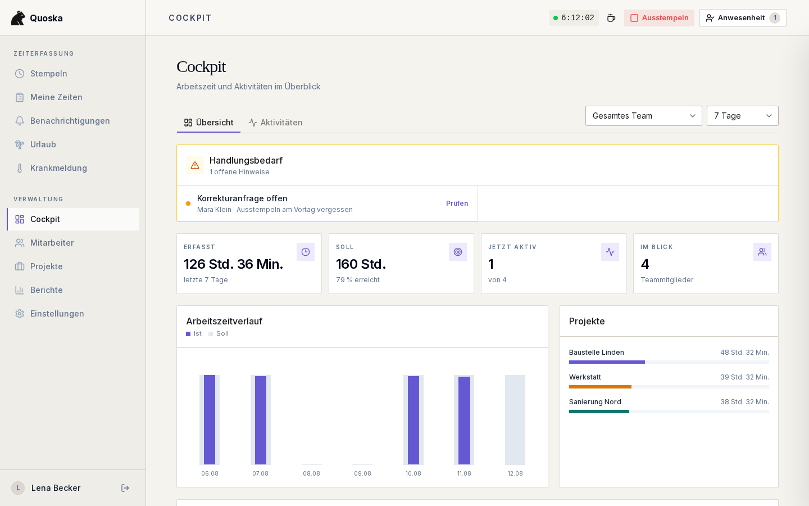
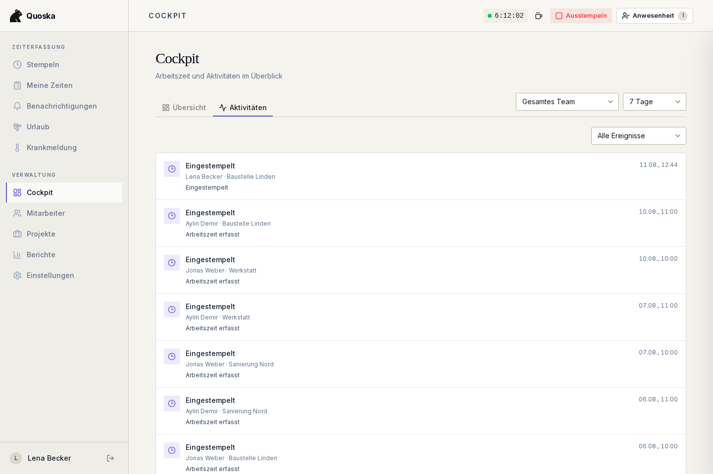
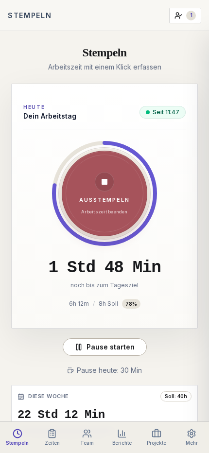

<p align="center">
  <picture>
    <source media="(prefers-color-scheme: dark)" srcset="public/banner-dark.png">
    <source media="(prefers-color-scheme: light)" srcset="public/banner-light.png">
    
  </picture>
</p>

<h3 align="center">Open-Source-Zeiterfassung für kleine Betriebe und Teams</h3>

<p align="center">
  Arbeitszeiten erfassen, Abweichungen früh erkennen und Änderungen<br>
  nachvollziehbar bearbeiten — am Desktop und im mobilen Browser.
</p>

<p align="center">
  <a href="https://quoska.de">Website</a> ·
  <a href="#schnellstart">Schnellstart</a> ·
  <a href="docs">Dokumentation</a> ·
  <a href="CONTRIBUTING.md">Beitragen</a>
</p>

<p align="center">
  <a href="https://github.com/quoska-hq/quoska/actions/workflows/ci.yml"></a>
  <a href="LICENSE"></a>
  
</p>

<br>

<p align="center">
  
</p>

## Überblick

Quoska bildet den Arbeitsalltag eines Teams in einer ruhigen Oberfläche ab:
Mitarbeitende stempeln Arbeitsbeginn, Pausen und Feierabend; Verantwortliche
sehen offene Aufgaben, Arbeitszeitentwicklungen und Änderungen an einer Stelle.

### Zeiterfassung

- Arbeitsbeginn, Pausen und Feierabend mit serverseitigen Zeitstempeln
- Tagesfortschritt und Wochensumme direkt in der Stempeluhr
- Korrekturanträge mit Begründung statt stiller Änderungen
- PWA für Desktop und mobilen Browser

### Team und Arbeitsmodelle

- Rollen für Mitarbeitende, Manager und Administratoren
- Flexible Wochenpläne für Teilzeit und unterschiedliche Arbeitstage
- Urlaub, Krankheit und Freigaben im selben System
- Feiertage passend zum hinterlegten Bundesland

### Überblick und Nachvollziehbarkeit

- Cockpit mit Handlungsbedarf, Teamstatus und Arbeitszeitentwicklung
- Filterbarer Aktivitäts- und Audit-Verlauf
- Projekte, Berichte und zeitraumbezogener CSV-Export
- Soft-Deletes für Zeitdaten und Mandantentrennung per PostgreSQL RLS

## Produktansichten

Die Bilder zeigen echte, mit reproduzierbaren Demo-Daten erzeugte
Produktansichten — keine separaten Marketing-Mock-ups.

<table>
  <tr>
    <td width="67%" valign="top">
      
    </td>
    <td width="33%" valign="top" align="center">
      
    </td>
  </tr>
  <tr>
    <td valign="top">
      <strong>Aktivitätsverlauf</strong><br>
      Zeitereignisse und Korrekturen nach Zeitraum, Person und Ereignistyp filtern.
    </td>
    <td valign="top">
      <strong>Mobile Stempeluhr</strong><br>
      Arbeitszeit, Pausen und Wochenfortschritt direkt im Browser erfassen.
    </td>
  </tr>
</table>

## Grundsätze

- **Serverzeit als Quelle:** Arbeitszeitereignisse entstehen nicht aus der
  veränderbaren Uhr des Clients.
- **Änderungen bleiben sichtbar:** Korrekturen erhalten Begründung, Urheber und
  Verlauf; erfasste Zeitdaten werden nicht hart gelöscht.
- **Klare Datengrenzen:** PostgreSQL Row-Level Security trennt die Daten der
  einzelnen Betriebe.
- **Eine offene Codebasis:** Selbst gehostete und verwaltete Instanzen verwenden
  denselben öffentlich einsehbaren Anwendungscode.

> Quoska unterstützt Betriebe bei der Dokumentation und Prüfung von
> Arbeitszeiten. Die konkrete betriebliche und rechtliche Umsetzung bleibt in
> der Verantwortung des Arbeitgebers.

## Schnellstart

Voraussetzungen: Node.js 20+, Docker und die
[Supabase CLI](https://supabase.com/docs/guides/local-development/cli/getting-started).

```bash
git clone https://github.com/quoska-hq/quoska.git
cd quoska
npm install
cp .env.example .env
supabase start
npm run dev
```

Übertrage vor dem Start die von Supabase ausgegebene lokale API-URL sowie den
Anon- und Service-Role-Key in `.env`. Die Anwendung läuft anschließend unter
<http://localhost:3000>; die Migrationen aus `supabase/migrations/` werden vom
lokalen Supabase-Projekt angewendet.

Für einen Produktionsbetrieb dienen
[`docs/deployment-hetzner.md`](docs/deployment-hetzner.md) und
[`docs/aws-s3-backups.md`](docs/aws-s3-backups.md) als Referenz.

## Technischer Aufbau

- Next.js 16, React 19 und TypeScript
- Tailwind CSS und shadcn/ui
- Supabase mit PostgreSQL, Auth und Row-Level Security
- Vitest und Playwright
- Docker und Caddy für den Produktionsbetrieb

```bash
npm test                 # Unit-, Integrations- und Compliance-Tests
npm run lint             # ESLint inklusive eigener Schutzregeln
npm run build            # Produktions-Build
npx playwright test      # End-to-End-Tests
```

Eigene ESLint-Regeln unter [`tools/eslint-rules/`](tools/eslint-rules) schützen
unter anderem vor Client-Zeitstempeln, Hard Deletes und Änderungen ohne
Audit-Felder. Architekturentscheidungen liegen unter
[`docs/decisions/`](docs/decisions).

## Quoska Cloud

Wer Quoska nicht selbst betreiben möchte, kann die verwaltete Version auf
[quoska.de](https://quoska.de) nutzen. Hosting, Updates und Backups werden dort
übernommen; die Anwendung basiert auf diesem Repository.

## Beitragen und Sicherheit

Issues, Diskussionen und Pull Requests sind willkommen. Hinweise zum lokalen
Setup und zu Änderungen an Zeitstempeln, Pausen oder Audit-Daten stehen in
[CONTRIBUTING.md](CONTRIBUTING.md) und [`docs/legal.md`](docs/legal.md).

Sicherheitsprobleme bitte nicht als öffentliches Issue melden. Der vertrauliche
Meldeweg steht in der [Security Policy](SECURITY.md).

## Lizenz

Quoska ist unter der [GNU Affero General Public License v3.0](LICENSE)
veröffentlicht. Wer eine veränderte Version als Netzwerkdienst anbietet, muss
den Nutzerinnen und Nutzern den entsprechenden Quellcode zugänglich machen.
